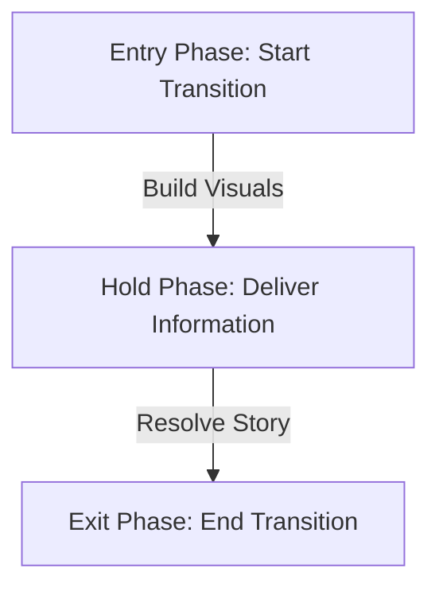

# Premium Apple-Style Visual & Motion Design Specification

This specification governs the creation of ultra-premium, high-trust motion graphics and data visualizations tailored for explainer videos in the US senior retirement space. The design aesthetic is inspired by Apple's clean typography, Stripe's fluid interactivity, and luxury editorial design.

---

## 🚫 Critical Architectural & Sync Constraints

### 1. Frame Rate Rule (25 FPS)
- **Constraint**: All source video assets in this workspace are rendered at exactly **25 fps**.
- **Rule**: You MUST configure all composition registrations in `Root.tsx` with `fps: 25`.
- **Implementation**: The frame calculation helper inside each motion component MUST multiply seconds by 25:
  ```typescript
  const f = (s: number) => Math.round(s * 25);
  ```
  *(Failure to do this causes a mismatch where the video runs 1.2x faster than the timeline, resulting in a frozen/stuck frame for the final 2–3 seconds of playback.)*

### 2. Transition Lifecycle End Rule (No Snapping/Cuts)
- **Rule**: Every visual component MUST complete its transition out/exit animation before the composition ends.
- **Timing**: Set the exit frame of your final visual beat to be at least **1.0 to 1.5 seconds (25 to 40 frames) before the composition's end frame**.
- **Purpose**: This ensures a smooth ease-out animation that leaves the viewer with a clean video background, avoiding any jarring cuts or frozen overlay frames when the player halts.

### 3. No `Overlays.tsx`
- Do NOT import elements from a shared `Overlays.tsx` file. Define styles, charts, and local sub-components inside their respective file.

---

## 🎨 The Cream & Apple Light Aesthetic

We build trust through warmth, luxury, and clarity using a warm, creamy, light Apple-style palette.

### Color Palette

| Name | Role | Hex / Value |
|---|---|---|
| **Cream Light** | Base background / Canvas overlay | `#F5F5F7` or `#F2F0EB` |
| **Soft Alabaster** | Card background | `rgba(255, 255, 255, 0.9)` |
| **Warm Onyx** | Principal text (H1, H2, H3) | `#1D1D1F` |
| **Muted Charcoal** | Secondary text / Labels | `#6E6E73` |
| **Classic Navy** | High-trust accents / Links | `#0066CC` |
| **Gold Leaf** | Financial highlights / Money | `#D4A373` or `#B58450` |
| **SAGE Green** | Positive gains / Increases | `#347052` |
| **Rust Red** | Reductions / Warnings | `#A63A3A` |

### Typography

To load these fonts, import them at the top of your composition files:
```css
@import url('https://fonts.googleapis.com/css2?family=Plus+Jakarta+Sans:wght@400;500;600;700&family=Playfair+Display:ital,wght@0,600;0,700;1,500&family=JetBrains+Mono:wght@600;800&display=swap');
```

- **H1 - H3**: `Playfair Display`, serif. Creates a premium, editorial, high-trust feel.
- **Body & Labels**: `Plus Jakarta Sans`, sans-serif. Modern, warm, extremely readable.
- **Amounts & Data**: `JetBrains Mono`, monospace. Perfect for numbers and ratios.

### Apple Glass Card Style
```typescript
const appleCardStyle: React.CSSProperties = {
  background: 'rgba(255, 255, 255, 0.88)',
  backdropFilter: 'blur(30px) saturate(190%)',
  border: '1px solid rgba(255, 255, 255, 0.4)',
  borderRadius: '24px',
  padding: '36px',
  color: '#1D1D1F',
  boxShadow: '0 30px 80px rgba(0, 0, 0, 0.08), 0 0 1px rgba(0, 0, 0, 0.04)',
};
```

---

## 🎬 Lifecycle of a Motion Graphic (The 3-Phase Rule)

No graphic should snap onto the screen or stay indefinitely. Every visual must follow a complete lifecycle:



1. **Start Transition (Entry)**: Elements slide or wipe into view gracefully. Use custom cubic-beziers.
2. **Deliver Message (Visual hold)**: The graphic displays its key data (bar chart growth, number ticker, timeline steps) while the narrator speaks.
3. **End Transition (Exit)**: Once the narrator transitions to a different subject, the graphic exits cleanly (e.g. slides out or fades away) so the viewer's focus returns to the video background before the next graphic appears.

---

## 📐 Layout Modes

### 1. Light Full-Screen Takeover
- **Fully Opaque Backdrop**: Uses a solid, 100% opaque warm cream background: `background: '#F5F5F7'`.
- The video background is **completely hidden** when a full-screen takeover is active to ensure absolute readability and focus on the data/typography.

### 2. Apple Side Panel
- Anchored to `right: 3%`, max width `440px`.
- Left side of the video remains completely visible.
- Exits completely before the next scene starts.

---

## 🎥 Video Background
- Always a flat, un-transformed cover layer.
- NO camera panning, zooming, scaling, or blurring on the video container.

---

## ⚡ Trending Animations & Micro-Interactions

To create a premium, high-production explainer feel, we avoid flat transitions. Implement multi-layered animations that trigger sequentially:

### 1. Mechanical Odometer (Digit Scroller)
- **Use Case**: Used for hero metrics, raises, cuts, and numbers (e.g. `+$400`, `-$480`, `7 in 10`, `35 years`).
- **Implementation**: Display digits in a vertical container with `overflow: 'hidden'`. Animate the vertical scroll offset using a spring transition with staggered delays:
  ```typescript
  // Spring settings for clean, mechanical overshoot
  transition={{ type: 'spring', damping: 15, stiffness: 60, delay }}
  ```

### 2. Multi-Layered Card Staggering (Staggered Internals)
- **Rule**: Do NOT fade or slide in container cards as a single static block. 
- **Sequence**:
  1. **Container Entrance**: Card slides in from the right (`x: 100` to `0`) or springs up from the bottom.
  2. **Brand Accents**: Top colored lines/bars animate their width (`scaleX` or `width` from `0` to final).
  3. **Label & Title Wipes**: The section label and H2 title are wrapped in hidden overflow boundaries (`overflow: 'hidden'`) and slide up sequentially from `y: '100%'` to `0`.
  4. **Staggered Badges / Rows**: Inner rows, bullets, or icons scale in (`scale: 0` to `1`) or slide in from the side with staggered increments of `0.1s` to `0.15s` delay.

### 3. Word-by-Word Subtitle Reveals
- **Use Case**: Subtitles or key taglines under hero takeover metrics (e.g. *"hiding in your check every month"*).
- **Implementation**: Split the text string by space characters and map each word. Wrap each word in an `inline-block` container with `overflow: 'hidden'` and stagger their vertical entry:
  ```tsx
  {text.split(" ").map((word, idx) => (
    <span key={idx} style={{ display: 'inline-block', overflow: 'hidden' }}>
      <motion.span
        style={{ display: 'inline-block' }}
        initial={{ y: '100%', opacity: 0 }}
        animate={{ y: 0, opacity: 1 }}
        transition={{ type: 'spring', damping: 16, stiffness: 100, delay: startDelay + idx * 0.08 }}
      >
        {word}
      </motion.span>
    </span>
  ))}
  ```

### 4. Dynamic Counting Numbers & Elastic Charts
- **Counting Numbers**: Animate value changes from zero to target dynamically using Framer Motion's `useMotionValue` and `animate()` inside a custom tag component.
- **Bar Grow Overshoots**: Animate comparison bars or progress indicators with an elastic ease-out curve (`ease: [0.34, 1.56, 0.64, 1]`) to add a high-fidelity bounce.
- **SVG Path Drawing**: Checkmarks or vectors must draw themselves dynamically using `strokeDasharray` and `pathLength` properties.

---

## 🔊 Audio Rendering & Encoding Rules

To ensure that rendered videos contain the correct voiceover, background music, and audio tracks, follow these rules in the headless render CLI:

### 1. Headless Video/Audio Mapping (FFmpeg)
- **Problem**: Capturing headless browser screenshots frame-by-frame ignores the audio of the browser tab.
- **Rule**: You MUST supply the original video asset as a second input to FFmpeg, mapping the audio track from the original video file while using the screenshots from Playwright for the video track.
- **FFmpeg Parameters**:
  - `-i original.mp4`: Input the source video with the voiceover track.
  - `-map 0:v`: Map the video frames from the browser screenshot stream (pipe:0).
  - `-map 1:a?`: Map the audio track from the original video. The `?` makes the mapping optional so the command does not fail if the source video has no audio.
  - `-c:a aac`: Re-encode the audio stream as high-quality AAC.
  - `-shortest`: Forces FFmpeg to stop encoding when the shortest input stream (the raw video frame pipe) ends, avoiding infinite rendering loops.

### 2. Web Audio API SFX Limitation
- **Constraint**: Sound effects synthesized programmatically at runtime via the browser's **Web Audio API** (oscillators, gains, noise buffers) are audible during **Live Preview** (since the browser plays sound in real-time), but are **NOT** captured by the headless frame-by-frame screenshot renderer.
- **Remedy**: For future projects, if sound effects are mandatory in the final output, they must either:
  1. Be pre-rendered once inside the browser to static `.wav` files and saved on disk.
  2. Be mixed into the final MP4 offline using FFmpeg delay filters (`adelay` and `amix`) at their exact trigger frame offsets.